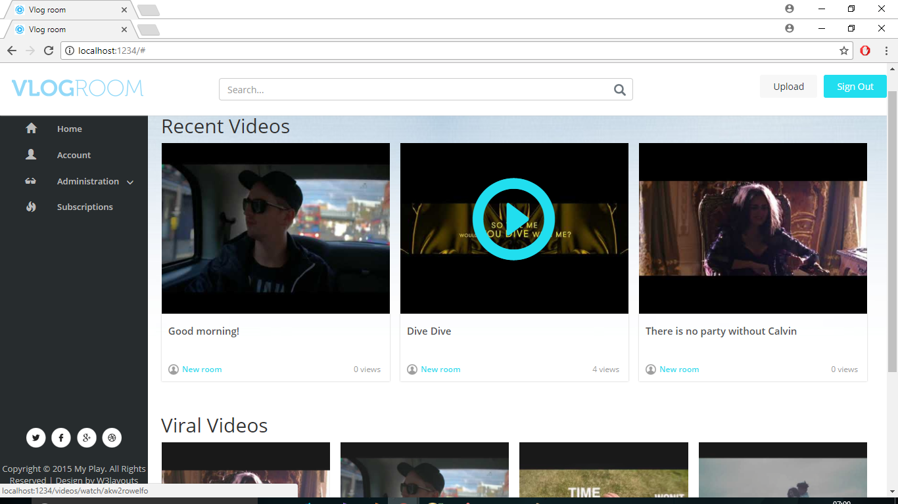

# VlogRoom

ASP.NET application for vloggers and video lovers.

## Getting Started

There are a few simple steps that you need to take in order to setup your room and start vlogging.
You only need to register if you dont have an account and you alredy can upload your first video!
After this go and customize your room name and check what the other vloggers talk about. Its pretty 
interesting.

## Application Demo
- [**Live Preview**](https://vlogroom.azurewebsites.net)
- [**Source code**](https://github.com/RosenUrkov/VlogRoom)

## Screenshots

## Authors

* **Rosen Urkov** - *Initial work* - [rosen.urkov](https://github.com/RosenUrkov)

## License

This project is licensed under the MIT License - see the [LICENSE.md](LICENSE.md) file for details
